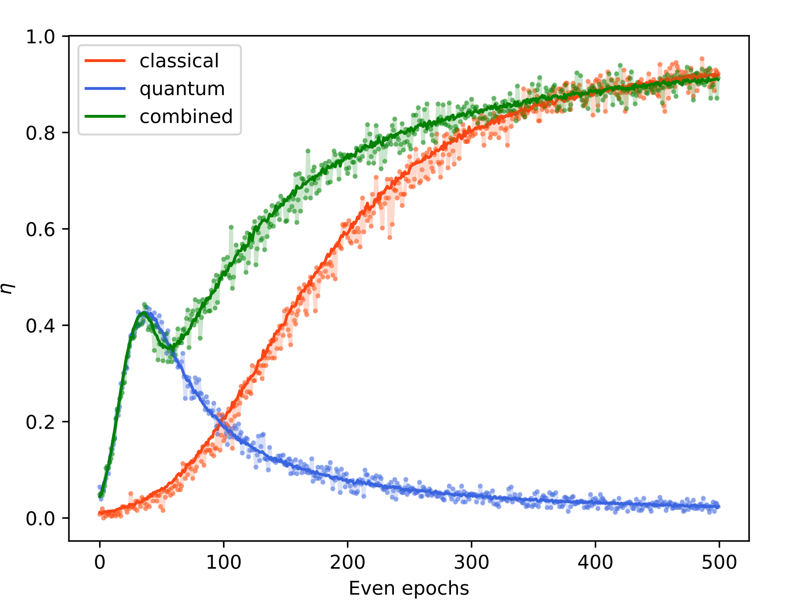

# QuantumEnhancedRL

- Author: Simone Caldarella
- E-mail: simone.caldarella98@gmail.com

## Description

Reinforcement Learning (RL) has emerged as a powerful framework for training intelligent agents to make optimal decisions in complex environments. In recent years, there has been a growing interest in enhancing classical Machine Learning algorithms through the use of Quantum Computers, leveraging the unique properties of quantum systems to speed up classical algorithms. More recent works focused on the more specific task of exploiting quantum speed up to improve the learning process in RL setting. 
Among the other, The work "Experimental Quantum Enhanced Reinforcement Learning" by Saggio et al., have shown that the introduction of an agent that possesses the ability to interact with its environment using both classical and quantum-mechanical methods can accelerate the learning process of the agent. In this dissertation I propose a brief introduction to both Reinforcement Learning and Quantum Computing, followed by the description of my implementation of the work accomplished by Saggio et al. I then show a comparison between my results and those presented in the paper and I conclude discussing my hopes and doubts related to the proposed framework.

## Results

